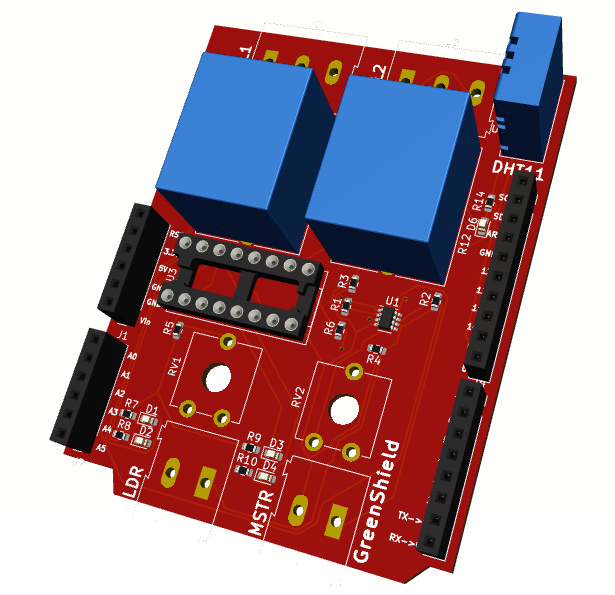

# Introduction
Green-Shield is an Arduino R3 shield for temperature, humidity, soil moisture and ambient light optimized for use in greenhouses where the said parameters are crucial for plant growth. 
This shield is designed as a top-of-stack shield because the relays may hinder stacking of other shields on top of it. 

## Electrical characteristics
| Specification | Value |
| -------------| -------------|
| VCC | 5V DC|
|Max out Current| 10A|
|No. of relays | 2|
| Output Channels | 2 |
| Input Channels | 3 |

At its core, while employing the ATMEGA328P Processor on the Arduino, Green-Shield uses the ULN2003A driver IC for powering the relays. ULN2003A can drive a relay at a max current of 10A. The relays
can be connected to actuators such as valves, pumps, fans and other control mechanisms according to the application requirements.

The inputs are three sensors, the soil moisture sensor, light dependent resistor for ambient light measurement and the DHT11 for temperature and humidity measurement.

#### Arduino pins usage
|Pin | Function |
|---------| ------------ |
| D2 | ULN2003A Channel 1 |
| D3 | ULN2003A Channel 2 |
| D4 | ULN2003A Channel 3 |
| D5 | ULN2003A Channel 4 |
| D7 | ULN2003A Channel 6 |
| D8 | DHT11 Data in |
| A0 | Soil moisture input|
| A1 | LDR Sensor input |

### Usage

 

